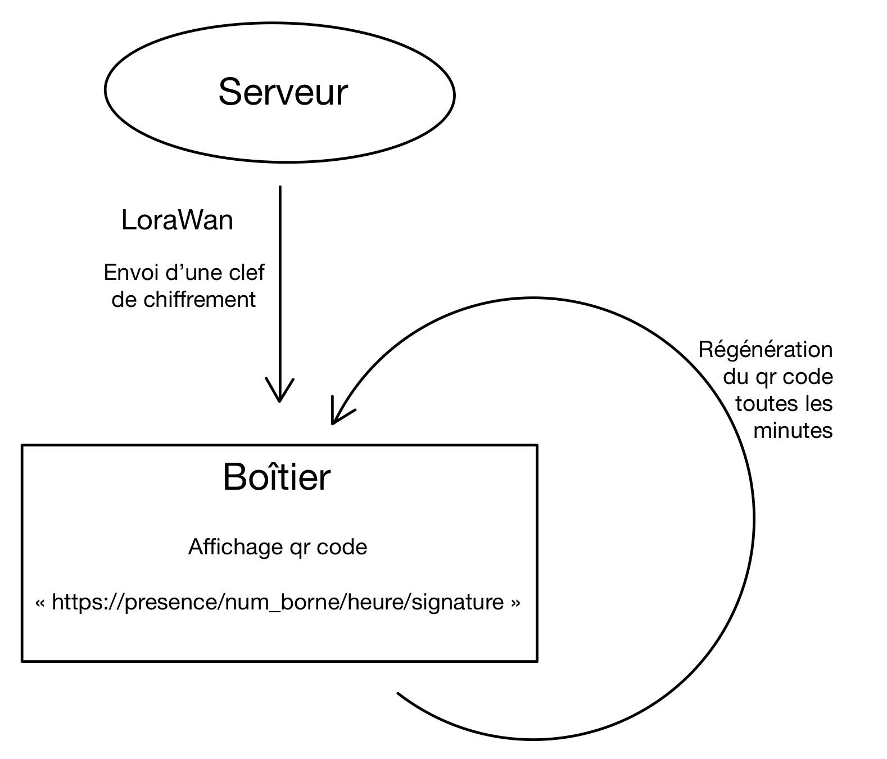

# Rapport Projet IOT:  Generation de QRCode

## Objectif du projet : 
Ce projet permet d’envoyer une url d’un serveur à un boîtier e-paper via une liaison LoraWan. Le boîtier génère et affiche par la suite un qr-code correspondant à l’url envoyée. On peut ainsi s'en servir de justificatif de présence. Cela peut permettre de nombreuses utilisations, par exemple : On peut envisager une course d’orientation “nouvelle génération” qui permettrait aux participants de chercher et de scanner les qr-codes. On pourrait aussi faire de la gestion de file d’attente mais aussi de la gestion de rondes de surveillance.
Dans ce projet nous utilisons une écran idosens pour afficher le qr code généré. De base l’écran idosens qui a servi pour réaliser un prototype était un système permettant de surveiller des pièces ou des lieux éloignés sans faire appel à une connexion Internet. Il était destiné particulièrement bien aux caves, aux garages, aux abris de jardins, aux remises et autres dépendances. Depuis 2016 le produit n’existe plus dans le marché, donc nous avons récupéré ce produit pour générer des qr-code. 

## Analyse du marché des produits commerciaux concurrents : 
La solution proposée étant à la fois très spécifique et permettant de nombreuses utilisations, il est difficile d’en trouver des produits concurrents. Nous nous sommes cependant penchés sur certaines des utilisations de notre projet pour en évaluer les autres solutions.
Nous pouvons remarquer dans un premier temps qu’il existe depuis longtemps le système des tickets avec un simple numéro pour gérer efficacement l’heure de passage des clients. Cette solution est plutôt simple et déjà implémentée mais elle a cependant le problème de dépenser des ressources comme du papier. Nous avons également la solution Izyfil qui consiste en une borne tactile de gestion de file d’attente. Cette borne permet de spécifier la raison de l’attente du client et lui imprime un ticket en fonction de la file d’attente vers laquelle le client doit se diriger. On a ici une solution très performante mais qui a, comme pour la solution précédente, le désavantage de beaucoup consommer mais également de toujours imprimer du papier. Notre solution prend ici un avantage par rapport aux autres.
Il existe également d'autres produits qui gèrent le QR code qui génèrent des QR codes pour gérer les files d'attente dans les restaurants et envoient des notifications aux utilisateurs lorsqu'une table est disponible. Voici quelques exemples:

**Qless:** une plateforme de gestion de files d'attente qui utilise des QR codes pour permettre aux clients de rejoindre une file d'attente virtuelle et de recevoir des notifications lorsqu'une table est disponible.

**Waitlist Me:** un système de gestion de files d'attente qui utilise des QR codes pour permettre aux clients de rejoindre une file d'attente virtuelle et de recevoir des notifications lorsqu'une table est disponible.

**TableUp:** une solution de gestion de file d'attente pour les restaurants qui utilise des QR codes pour permettre aux clients de rejoindre une file d'attente virtuelle et de recevoir des notifications lorsqu'une table est disponible.

## L’architecture globale du systèmes : 

On utilise ici un boîtier idosens sensor, le boitier permet d’afficher des qr code. Pour développer notre produit nous avons utilisé une carte STM32 Nucleo-32, la carte téléverse le programme développé sur le boîtier.. 
L'architecture globale de ce système comprend donc plusieurs éléments :

**Le boîtier idosens sensor** : l'élément physique du système. Il est composé d'une carte électronique et d'un écran e-ink pour afficher des QR codes. Il est alimenté par une source USB.

**Une carte STM32 Nucleo-32** : utilisée pour développer le programme qui est ensuite téléversé sur le boîtier.

**Le protocole LoRaWAN** : utilisé pour recevoir l’URL et ensuite envoyer le qr code. 

**Chirp Stack:** serveur qui permet d’afficher les données envoyées par le LoRaWAN de les rendre accessibles à distance pour une analyse ou une utilisation ultérieure.
Ensemble, ces éléments forment un système qui permet de collecter des données à partir d'un boîtier physique, de les stocker dans le cloud et de les envoyer au boîtier. 

## Sécurité globale du système : 

On envoie les données cryptées avec une clef de hachage. On envoie un URL qui contient l’heure en seconde depuis l’epoch de Linux, l’identifiant de l’écran idosens signé. On chiffre l’URL avec un clé globale, ce qui permet de protéger les données envoyées de manière efficace lorsqu'elles sont transmises. Cela implique l'utilisation d'une clé de chiffrement unique pour chiffrer toutes les données, plutôt que d'utiliser des clés différentes pour chaque session de communication ou pour chaque QR code. Cela rend le déchiffrement des données plus difficile pour les personnes non autorisées, car ils doivent d'abord découvrir la clé de chiffrement globale avant de pouvoir accéder aux données.

## Le respect de la vie privée du service (RGPD) : 

Le respect de la vie privée est un enjeu crucial pour tout service qui génère des QR codes avec LoRaWAN, et il est important de prendre en compte les différents risques d'atteinte à la vie privée qui peuvent survenir dans ce cas : 

**Stockage des données :** Les QR codes générés peuvent contenir des informations sensibles, il est important de s'assurer que ces données sont stockées de manière sécurisée. L’URL qu’on envoie est un URL signé donc elle est difficile d'accéder au URL.  
  
  
**Vie privée des utilisateurs :** Il est important de s'assurer que les QR codes ne sont pas utilisés pour surveiller les utilisateurs de manière non autorisée. Notre produit n’atteint pas la  vie privée des utilisateurs du boîtier puisque la seule information qui transite est que le qr code a été flashé. On pourrait imaginer un scénario où le système qui envoie les qr codes se fait hacker et enverrait des qr codes endommagés. Cependant, cela ne concerne pas notre programme qui gère la liaison entre le serveur et le boîtier.
  
  
**Prévention de la fuite des données :** les données stockées dans les QR codes ne sont pas diffusées à des tiers non autorisés. 

## L’architecture matérielle du produit : 

**Boîtier en plastique :** Il sert de protection pour les composants électroniques et de support pour l'écran e-paper.

**PCB (Circuit imprimé) :** Pour connecter les différents composants électroniques et pour permettre la communication entre ces composants.

**Ecran e-paper :** Pour afficher les qr-code. Il est alimenté par une batterie ou une alimentation fixe en fonction de l’utilisation.

**Batterie / Alimentation :** Pour alimenter l'écran e-paper et les autres composants.

## Le coût de la BOM de votre produit :

On a réalisé le prototype à l’aide d’un boîtier idosens comprenant déjà un écran e paper, un pcb et un boitier. Nous allons donc développer le coût de chaque composant si on devait le réaliser en gros. Dans le cas de la création de 5 000 boîtiers : 

**Coût du boîtier en plastique :** Environ 0,50 € par unité, soit un coût total de 2500 € pour 5000 exemplaires.

**Coût du PCB :** Environ 5 € par unité, soit un coût total de 25 000 € pour 5000 exemplaires.

**Coût de l'écran e-paper :** Environ 15 € par unité, soit un coût total de 75 000 € pour 5000 exemplaires.

**Coûts de fabrication :** Environ 10 € par unité, soit un coût total de 50 000 € pour 5000 exemplaires.

## Le coût de certification ETSI du produit et le coût de certification LoRa Alliance du produit : 

Le coût de certification ETSI pour un produit peut varier en fonction de plusieurs facteurs  on peut toutefois estimer un coût de certification d'environ 5000 à 10000€ pour un produit standard.

Concernant les coûts de certification Lora Alliance, on peut estimer à environ 2500€ la certification. 

## Une implémentation du logiciel embarqué de l’objet QRCode generation : 

Voici une implémentation possible d'un logiciel embarqué pour génèrer un QR code:

- Intégrer une bibliothèque de génération de QR code, comme QRgen, à notre projet.

- Utiliser l’écran Idosens pour afficher le QR code généré.

- Utiliser le protocole LoraWan pour recevoir l’URL et envoyer le QR code  qui correspond à l’URL signé à l’écran Idosens .

- Dans notre code, créer une fonction pour générer le QR en utilisant la bibliothèque de génération de QR code.

- Utiliser la fonction pour générer le QR code avec les données souhaitées dans notre cas une URL qui contient une signature,l'identifiant de l'écran Idosens et une date calculée depuis l'epoch de Linux.

- Générer un QR code chaque 60s par exemple

- Afficher le QR code généré sur l'écran Isodense 

Il est important de noter que ceci n'est qu'une implémentation possible et qu'il peut y avoir des étapes supplémentaires.Il est également important de suivre les réglementations de l'utilisation de QR code en France et de suivre les normes de sécurité appropriées.
Le Schéma suivante explique le logiciel embarqué implémenter dans le boîtier 

## Les métriques logiciel du logiciel embarqué : 

## Analyse du cycle de vie du produit : 

